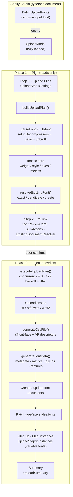

# @liiift-studio/sanity-font-manager

[](https://www.npmjs.com/package/@liiift-studio/sanity-font-manager)
[](#license)
[](https://www.sanity.io/)

Full font management suite for Sanity Studio. Handles batch upload, multi-format conversion, metadata extraction, CSS `@font-face` generation, collection and pair generation, and script variant management.

Drag a folder of font files onto a typeface document and the plugin parses each file, detects its weight and style, checks for an existing document, then — after you review and confirm — uploads every format, generates the `@font-face` CSS and metadata, creates or updates the font documents, and maps any variable-font instances.

Compatible with Sanity v3, v4, and v5.

## How it works

The upload flow is a two-phase **plan → execute** pipeline: phase 1 parses files and resolves duplicates with **reads only**, you review and edit the result, then phase 2 performs all **writes**. Font parsing runs on [`lib-font`](https://github.com/Pomax/lib-font) (WOFF/WOFF2 decompression is bootstrapped via `pako` + a vendored `unbrotli`), so no native binaries are required.



> The Mermaid source lives at [`assets/upload-pipeline.mmd`](assets/upload-pipeline.mmd) and renders inline on GitHub. **A maintainer screenshot or short GIF of the live upload modal** (drag → review table → execute → instance mapping) would make the workflow even clearer — these Studio components cannot be captured headlessly, so it is left as a follow-up. Drop the image into `assets/` and reference it with an absolute `raw.githubusercontent.com` URL.

---

## Installation

```bash
npm install @liiift-studio/sanity-font-manager
```

### Peer dependencies

```bash
npm install sanity @sanity/ui @sanity/icons react @liiift-studio/sanity-advanced-reference-array
```

| Peer | Required version | Notes |
|---|---|---|
| `sanity` | `>=3` | |
| `@sanity/ui` | `>=3` | |
| `@sanity/icons` | `>=3` | |
| `react` | `>=18` | |
| `@liiift-studio/sanity-advanced-reference-array` | `>=1` | **Required for the [Quickstart](#quickstart) path.** `createStylesField` and the typeface reference-array fields import it at module load, so importing them without it installed will throw. You only need it if you wire fields the manual way and skip both. |

If you hit peer dependency conflicts, add `legacy-peer-deps=true` to your `.npmrc`.

### Parsing dependencies

Font parsing relies on [`lib-font`](https://github.com/Pomax/lib-font) and `pako` at runtime. If they are not already present in your studio's `node_modules`, install them alongside the plugin:

```bash
npm install lib-font pako
```

---

## Quickstart

Wire `BatchUploadFonts` onto the `styles` field of a typeface document and you get the full drag-and-drop upload modal. The fastest way to build the rest of the `styles` object is the `createStylesField` factory, which assembles the fonts/variable-font/collections/pairs reference arrays for you.

```jsx
// schemas/typeface.js
import {
  BatchUploadFonts,
  createStylesField,
  openTypeField,
  styleCountField,
} from '@liiift-studio/sanity-font-manager';

export const typeface = {
  name: 'typeface',
  type: 'document',
  groups: [
    { name: 'styles', title: 'Styles' },
    { name: 'openType', title: 'Open Type' },
  ],
  fields: [
    { name: 'title', type: 'string' },

    // The drag-and-drop batch uploader lives on the styles object.
    {
      ...createStylesField({ generateCollections: true, pairs: true, styleCount: true }),
      components: { input: BatchUploadFonts },
    },

    // Spreadable pre-built fields (optional):
    styleCountField,
    openTypeField,
  ],
};
```

Then set the required environment variables in your studio (`SANITY_STUDIO_SITE_URL`, `SANITY_STUDIO_PROJECT_ID`, `SANITY_STUDIO_DATASET` — see [Environment variables](#environment-variables)). Multi-format conversion and subsetting additionally need a `/api/sanity/fontWorker` endpoint on the consuming site (see [`generateFontFile`](#css-and-file-generation) / [`generateSubset`](#css-and-file-generation)); TTF/OTF/WOFF/WOFF2 upload, parsing, CSS, and metadata work without it.

Open a typeface document, drag font files onto the styles field, review the detected weights/styles, resolve any duplicates, and confirm. See [Upload workflow](#upload-workflow) for the full step-by-step.

### Prerequisites the consumer provides

This plugin supplies the upload UI, parsing, and field factories — it writes to `font` and `typeface` document types that **your studio defines**. Use the [Schema fields](#schema-fields) tables below as the contract for the document shapes the uploaders read and patch (the `font` document's `fileInput`/`metaData`/`metrics` objects, the `typeface` document's `styles.fonts`/`styles.variableFont` arrays). `createStylesField` builds the `styles` object for you; the surrounding `typeface` and `font` document types are yours to declare.

### The `fontWorker` endpoint (multi-format conversion / subsetting)

TTF/OTF/WOFF/WOFF2 upload, parsing, CSS, and metadata all work with no extra infrastructure. The additional conversions (`generateFontFile`, `generateSubset` — EOT/SVG and DS-WEB/subset WOFF2) are delegated to a `POST /api/sanity/fontWorker` route **you implement on the consuming site**, because the conversion runs server-side. The plugin sends a JSON body of:

```jsonc
{ "code": "generate-fonts", "srcUrl": "...", "filename": "...", "documentId": "...", "codes": ["woff", "eot", ...] }
```

(plus `documentTitle`, `documentVariableFont`, `documentStyle`, `documentWeight`, `fileInput`, `language`). The endpoint URL is derived from `SANITY_STUDIO_SITE_URL`. The request is fire-and-forget (`mode: 'no-cors'`), so the worker writes the converted assets back to the Sanity document itself.

---

## Upload workflow

`BatchUploadFonts` opens `UploadModal`, a multi-step dialog that takes you from raw font files to linked Sanity documents. The flow is split into two phases — a preview you can edit, then the actual upload — so **nothing is written until you confirm**. Each step lists the component that implements it (in parentheses) for developers; the plain-language action comes first.

1. **Drag in your fonts** — drop TTF/OTF/WOFF/WOFF2 files onto the styles field and set defaults like price and how filenames map to titles. *(`UploadStep1Settings`)*
2. **Review what it detected** — the modal parses every file and shows a table of detected weight, style, and subfamily, all editable per font. Any font that already exists gets an **update existing vs create new** toggle so a re-upload updates the right document instead of duplicating it. This step only **reads** from Sanity. *(`UploadStep2Review` · `FontReviewCard` · `BulkActions` · `ExistingDocumentResolver`, driven by `buildUploadPlan` + `resolveExistingFont`)*
3. **Confirm to upload** — on your confirmation the assets are uploaded, `@font-face` CSS and metadata are generated, font documents are created or updated, and the typeface's `styles.fonts` array is patched. Progress is shown per font. *(`UploadStep3Execute`, driven by `executeUploadPlan`)*
4. **Map variable-font instances** — for a variable font, its named instances (e.g. *Light*, *Bold*) are matched to the matching static font documents; an **Autofill with Matching** action does this for you, and missing instances can be created. *(`UploadStep3bInstances` — see [`VariableInstanceReferencesInput`](#variableinstancereferencesinput))*
5. **Review the summary** — a per-font created / updated / failed report. *(`UploadSummary`)*

### Plan / Execute API

The pipeline is also exported as plain functions and reducers, so the upload engine can be driven or tested independently of the modal UI.

| Export | Description |
|---|---|
| `UploadModal` | The full multi-step modal dialog. Props: `open`, `onClose`, `client`, `docId`, `typefaceTitle`, `stylesObject`, `preferredStyleRef`, `slug`, `defaults`. Lazy-loaded by `BatchUploadFonts`. |
| `UploadStep1Settings`, `UploadStep2Review`, `UploadStep3Execute`, `UploadStep3bInstances`, `UploadSummary` | The individual step components, exported for custom modal layouts. |
| `FontReviewCard` | Collapsible per-font review row with editable weight/style/title/document-ID and a files indicator. |
| `BulkActions` | Sticky search/filter/expand-all bar for the review step, with create/update/error/conflict counts. |
| `ExistingDocumentResolver` | The update-existing vs create-new toggle and candidate picker for a single font. |
| `buildUploadPlan` | **Phase 1** — reads font files, parses with `lib-font`, resolves existing documents, and returns a complete `UploadPlan` for review. Performs Sanity reads only. |
| `executeUploadPlan` | **Phase 2** — uploads assets, generates CSS/metadata, creates/updates font documents, and patches the typeface. Skips fonts marked `error`; caches asset refs for idempotent retry. |
| `resolveExistingFont` | Resolves whether a font already exists — exact `_id`/slug match first, then content match by `typefaceName + weightName + style + subfamily + variableFont`. Returns `{ exact, candidates, recommendation, lookupFailed }`. |
| `planReducer` | Reducer driving the plan state machine (file processing, user edits, document resolution). |
| `executionReducer`, `createInitialExecutionState` | Reducer + initializer tracking per-font execution progress. |
| `createEmptyPlan`, `createFontDecisions` | Factories for an empty `UploadPlan` and a font's decision record. |
| `FONT_STATUS`, `PLAN_PHASE`, `RECOMMENDATION`, `EXECUTION_STATUS`, `PLAN_VERSION` | Enum constants for plan/execution state (single source of truth in `planTypes`). |

---

## Safety &amp; reliability

The upload engine is built to be pointed at a production dataset:

- **Review before write.** Phase 1 (`buildUploadPlan`) only **reads** — it parses files and looks up existing documents. No font document is created or modified until you confirm the plan and Phase 2 (`executeUploadPlan`) runs.
- **Duplicate resolution.** `resolveExistingFont` matches incoming fonts to existing documents (exact ID/slug, then content match) so a re-upload updates the right document instead of creating a duplicate.
- **Concurrency limit.** Asset uploads run at most `CONCURRENCY_LIMIT` (3) at a time.
- **Rate-limit handling.** `429` responses are retried up to `MAX_RETRIES` (3) with exponential backoff and ±25% jitter (`backoffWithJitter`), so large batches don't hammer the API. The retry is rate-limit-specific — other failures (a `500`, a network drop) fail that font rather than retrying, and it surfaces in the per-font summary.
- **Per-font isolation.** Uploads run via `Promise.allSettled`, so one font failing does not abort the rest of the batch; each font's outcome is tracked independently.
- **Idempotent retry.** Execution caches asset references in progress, so a partially failed batch can be retried without re-uploading assets that already succeeded; fonts marked `error` are skipped.
- **Long-upload guards.** The modal holds a Wake Lock and installs a `beforeunload` guard while executing, and confirms before closing mid-flight.

## Testing

The package ships a [Vitest](https://vitest.dev/) suite under `src/tests/` covering the reducers (`planReducer`, `executionReducer`), plan types, document resolution, font parsing/metadata, CSS generation, keyword expansion, and a `lib-font` integration test with a mock font fixture.

```bash
npm test          # vitest run
npm run test:watch
```

The `build` script (`npm run build`) runs the test suite before bundling with `tsup`, so a broken test blocks publish. (The suite — like the runtime — requires `lib-font` and `pako` in `node_modules`; see [Parsing dependencies](#parsing-dependencies).)

---

## Components

### `BatchUploadFonts`

Drag-and-drop batch uploader for a typeface document. Accepts TTF/OTF/WOFF/WOFF2 etc., shows a reviewable file list with count, confirm button, elapsed timer, Wake Lock, and `beforeunload` guard for long uploads. Calls `uploadFontFiles` for each batch.

```jsx
import { BatchUploadFonts } from '@liiift-studio/sanity-font-manager';

export const typefaceSchema = {
  name: 'typeface',
  type: 'document',
  fields: [
    {
      name: 'styles',
      type: 'object',
      components: { input: BatchUploadFonts },
      fields: [ /* see Schema fields below */ ],
    },
  ],
};
```

### `SingleUploaderTool`

Per-font file manager inside a font document. Shows TTF/OTF/WOFF/WOFF2/CSS rows always. EOT/SVG/WEB/SUBSET/DATA are hidden behind an advanced toggle (cog icon). Each row has Upload/Build/Delete controls. Handles CSS regeneration, font data extraction, and WEB+SUBSET building via fontWorker.

```jsx
import { SingleUploaderTool } from '@liiift-studio/sanity-font-manager';

{
  name: 'fileInput',
  type: 'object',
  components: { input: SingleUploaderTool },
  fields: [ /* format fields — see Schema fields below */ ],
}
```

### `GenerateCollectionsPairsComponent`

One-click generator for Full Family, Uprights, Italics, and Subfamily collections, plus Regular/Italic pairs matched by weight. Has configurable price inputs for collection-per-font and pair price.

```jsx
import { GenerateCollectionsPairsComponent } from '@liiift-studio/sanity-font-manager';
```

### `PrimaryCollectionGeneratorTypeface`

One-click generator for a single full-family collection that includes all fonts linked to the typeface. Prepends the new collection to the existing `styles.collections` array — non-destructive. Uses `SANITY_STUDIO_DEFAULT_COLLECTION_PRICE` as the default price, falling back to `100`.

Wire it up on a `string` field in the typeface schema:

```jsx
import { PrimaryCollectionGeneratorTypeface } from '@liiift-studio/sanity-font-manager';

{
  name: 'generateCollectionGroup',
  type: 'string',
  title: 'Generate Full Family Collection',
  description: 'Generate a collection that includes all the styles from this typeface.',
  components: { input: PrimaryCollectionGeneratorTypeface },
  hidden: ({ parent }) => !parent?.styles?.fonts?.length,
}
```

### `FontScriptUploaderComponent`

Script-aware uploader for per-script font file variants (Latin, Arabic, Hebrew, etc.) stored in `scriptFileInput` on the font document.

### `UploadScriptsComponent`

Batch uploader for script-specific font variants across multiple fonts at once.

### `UpdateScriptsComponent`

Updates and re-links existing script font variant references on font documents — used to fix or reassign script variant assignments.

### `RegenerateSubfamiliesComponent`

Recalculates and patches the `subfamily` field on all fonts linked to a typeface, based on the typeface's defined subfamily groups — without re-uploading any files.

### `SetOTF`

Detects which configured OpenType feature keys are supported by the typeface's first linked font. Reads `opentypeFeatures.chars` from the font document (populated by `generateFontData`) and patches the `features` array on the field. Shows a feature count when features are detected, and clear error messages when font data is missing.

Wire it up on the `openType` object field in the typeface schema:

```jsx
import { SetOTF } from '@liiift-studio/sanity-font-manager';

{
  name: 'openType',
  type: 'object',
  components: { input: SetOTF },
  options: { collapsible: true },
  fields: [ /* feature fields — each with a `feature` string e.g. 'liga', 'smcp' */ ],
}
```

### `StyleCountInput`

Displays the total number of font styles (static + variable) linked to a typeface. Reads `styles.fonts` and `styles.variableFont` arrays from the form context. Useful as a read-only display field in the typeface schema.

```jsx
import { StyleCountInput } from '@liiift-studio/sanity-font-manager';

{
  name: 'styleCount',
  type: 'number',
  readOnly: true,
  components: { input: StyleCountInput },
}
```

### `KeyValueInput`

Generic ordered key-value editor where both keys and values are plain strings. Supports add, remove, and reorder (up/down arrows). Values are stored as an array of `{ key, value }` objects.

```jsx
import { KeyValueInput } from '@liiift-studio/sanity-font-manager';

{
  name: 'aliases',
  type: 'array',
  of: [{ type: 'object', fields: [{ name: 'key', type: 'string' }, { name: 'value', type: 'string' }] }],
  components: { input: KeyValueInput },
}
```

### `KeyValueReferenceInput`

Generic key-value editor where keys are plain strings and values are weak Sanity document references. Supports searching by title via a popover picker, add/remove/reorder, and an optional `topActions` slot for action buttons above the list.

| Prop | Type | Description |
|---|---|---|
| `fetchReferences` | `async (client, doc) => [{_id, title}]` | Async function that returns candidate references for the picker. Receives the Sanity client and the current document. |
| `topActions` | `ReactNode` | Optional content rendered above the key-value rows (e.g. autofill buttons). |
| `referenceType` | `string` | Document type for the created weak references (default: `'font'`). |

```jsx
import { KeyValueReferenceInput } from '@liiift-studio/sanity-font-manager';

{
  name: 'instanceMap',
  type: 'array',
  of: [{ type: 'object', fields: [{ name: 'key', type: 'string' }, { name: 'value', type: 'reference', weak: true, to: [{ type: 'font' }] }] }],
  components: { input: KeyValueReferenceInput },
  // Pass props via options or a wrapper component:
  options: {
    fetchReferences: async (client, doc) => client.fetch('*[_type == "font"]{_id, title}'),
    referenceType: 'font',
  },
}
```

### `VariableInstanceReferencesInput`

Font-specific wrapper around `KeyValueReferenceInput` for mapping variable font instance names to their matching static font documents. Provides:

- A picker filtered to fonts sharing the same `typefaceName`, excluding variable fonts
- **Autofill with Matching** — calls `parseVariableFontInstances` to match instance names to existing font documents by weight/style heuristics
- **Autofill Keys Only** — populates instance name keys from the font's `variableInstances` metadata without resolving references
- Autofill buttons are shown only when the document is a variable font with parsed instance data
- Replace/merge confirmation dialog when pairs already exist

```jsx
import { VariableInstanceReferencesInput } from '@liiift-studio/sanity-font-manager';

{
  name: 'variableInstanceReferences',
  title: 'Variable Font Instances',
  type: 'array',
  hidden: ({ parent }) => !parent.variableFont,
  of: [
    {
      type: 'object',
      fields: [
        { name: 'key', type: 'string', title: 'Instance Name' },
        { name: 'value', type: 'reference', weak: true, to: [{ type: 'font' }], title: 'Matching Font' },
      ],
    },
  ],
  components: { input: VariableInstanceReferencesInput },
}
```

### `NestedObjectArraySelector`

Generic Sanity input that renders a searchable checkbox list of items pulled from a nested array field across documents of a given type (backed by [`useNestedObjects`](#usenestedobjects)). Configure entirely via schema `options`.

```jsx
import { NestedObjectArraySelector } from '@liiift-studio/sanity-font-manager';

{
  name: 'sections',
  type: 'array',
  of: [{ type: 'string' }],
  components: { input: NestedObjectArraySelector },
  options: {
    sourceType: 'licenseGroup',   // document type to query
    nestedField: 'sections',       // array field to extract
    titleField: 'title',           // GROQ expression for display text
    valueField: 'slug.current',    // GROQ expression for stored value
    filter: 'state == "published"',// optional GROQ filter
    sortBy: 'title asc',           // optional sort
    emptyMessage: 'No options found',
    searchPlaceholder: 'Search...',
  },
}
```

### `StatusDisplay`

Shared status bar used by all components. Shows `Status: [message]` in green on success and red on error, with an optional `action` element slot on the far right (used for the advanced toggle in `SingleUploaderTool`).

```jsx
import { StatusDisplay } from '@liiift-studio/sanity-font-manager';

<StatusDisplay status="ready" error={false} action={<Button ... />} />
```

### `PriceInput`

Reusable `$` + number input for collection and pair price fields.

### `UploadButton`

Label-wrapped button that triggers a hidden file input.

---

## Schema field definitions

Pre-built Sanity schema field objects that can be spread directly into a typeface schema's `fields` array. Eliminates hundreds of lines of repeated field definitions across consumer studios.

### `createStylesField`

Factory that builds the complete `styles` object field — the fonts, variable-font, collections, and pairs reference arrays plus the subfamily groups — for a typeface document. This is the field `BatchUploadFonts` reads and writes (see [Quickstart](#quickstart)). Call it with options to toggle optional sub-fields:

```js
import { createStylesField, BatchUploadFonts } from '@liiift-studio/sanity-font-manager';

{
  ...createStylesField({ generateCollections: true, pairs: true, styleCount: true }),
  components: { input: BatchUploadFonts },
}
```

| Option | Default | Description |
|---|---|---|
| `pairs` | `true` | Include the Regular/Italic pairs reference array. |
| `generateCollections` | `false` | Include the collections array + `GenerateCollectionsPairsComponent`. |
| `generateFullFamilyCollection` | `false` | Include the full-family collection generator (`PrimaryCollectionGeneratorTypeface`). |
| `regenerateSubfamilies` | `false` | Include the `RegenerateSubfamiliesComponent` action. |
| `styleCount` | `false` | Inject the read-only style-count field (`StyleCountInput`). |
| `displayStyles`, `free`, `serif`, `sortHeaviestFirst`, `buySectionColumns`, `fontSizeMultiplier`, `subfamily*` | various | Storefront/display toggles — see the source for the full set. |

> Uses `@liiift-studio/sanity-advanced-reference-array` (a peer dependency — see [Peer dependencies](#peer-dependencies)) for the typeface-scoped reference pickers.

### `openTypeField`

A complete `openType` object field wired to the `openType` tab group. Includes the `features` checkbox array (all standard OpenType feature keys) plus per-feature sub-objects with `title`, `feature`, and `customText` fields. Uses `SetOTF` internally for auto-detection.

```js
import { openTypeField } from '@liiift-studio/sanity-font-manager';

// In your typeface schema fields array:
openTypeField,
```

Requires the `openType` group to be declared in your schema's `groups` array:
```js
{ name: 'openType', title: 'Open Type' }
```

### `createOpenTypeField`

Factory variant of `openTypeField`. Pass `{ customText: true }` to reveal a per-feature `customText` input on every feature object; pass `{ customText: true, customTextType: 'code' }` to make it a syntax-highlighted HTML `code` field (for `<span>`-wrapped sample text). Returns a plain `openTypeField` when `customText` is `false`.

```js
import { createOpenTypeField } from '@liiift-studio/sanity-font-manager';

// In your typeface schema fields array:
createOpenTypeField({ customText: true, customTextType: 'code' }),
```

### `styleCountField`

A read-only `number` field in the `styles` group that displays the total count of static + variable font styles linked to the typeface. Uses `StyleCountInput` internally.

```js
import { styleCountField } from '@liiift-studio/sanity-font-manager';

// In your typeface schema fields array:
styleCountField,
```

### `stylisticSetField`

A complete `stylisticSet` object field for the `stylisticSets` group. Contains two sub-arrays: `featured` (highlighted words/phrases with per-character backtick syntax, stylistic feature picker, size, and CSS overrides) and `sets` (full catalogue of feature → glyph mappings). Both include the full OpenType feature dropdown (44 named features + all 20 stylistic sets).

```js
import { stylisticSetField } from '@liiift-studio/sanity-font-manager';

// In your typeface schema fields array:
stylisticSetField,
```

Requires the `stylisticSets` group to be declared in your schema's `groups` array:
```js
{ name: 'stylisticSets', title: 'Stylistic Sets' }
```

---

## Hook

### `useSanityClient`

Returns the Sanity client instance from the studio context. Used internally by all components.

```js
import { useSanityClient } from '@liiift-studio/sanity-font-manager';

const client = useSanityClient();
```

### `useNestedObjects`

Fetches and flattens a nested array field across documents of a given type into a flat list of selectable items. Backs `NestedObjectArraySelector`.

```js
import { useNestedObjects } from '@liiift-studio/sanity-font-manager';

const { objects, loading, error } = useNestedObjects({
  sourceType: 'licenseGroup',   // document type to query
  nestedField: 'sections',      // array field to extract
  titleField: 'title',          // GROQ expression for display text
  valueField: 'slug.current',   // GROQ expression for stored value
  filter: 'state == "published"', // optional GROQ filter
  sortBy: 'title asc',          // optional sort
});
```

---

## Utilities

### Font parsing (lib-font)

Parsing runs on [`lib-font`](https://github.com/Pomax/lib-font). `parseFont` is the single entry point; the `fontHelpers` wrappers are the only code that touches `font.opentype.tables.*`. `setupDecompressors` registers `globalThis.pako` (WOFF) and `globalThis.unbrotli` (WOFF2) and is imported as a side effect by the package entry point and by `parseFont` — **import order matters**, so do not import `lib-font` directly before it.

| Export | Description |
|---|---|
| `parseFont` | `async (buffer, filename) => Font` — parses an `ArrayBuffer` into a `lib-font` `Font`. Enforces a 50 MB size limit and a 30 s timeout; throws on oversize/corrupt/timeout. |
| `getNameString` | Reads a name-table string by numeric name ID, preferring Windows/Unicode/English then Mac/Roman, with a per-font cache. |
| `getAllFeatureTags` | All OpenType feature tags from GSUB/GPOS (equivalent to fontkit's `availableFeatures`). |
| `getCharacterSet` | Array of Unicode code points covered by the font. |
| `getVariationAxes` | Variation-axis map for variable fonts (`min`/`default`/`max` per axis). |
| `getNamedInstances` | Named instances of a variable font. |
| `getFontMetrics` | `unitsPerEm`, ascender/descender, cap/x-height, italic angle, etc. |
| `getFontMetadata` | `postscriptName`, `fullName`, `familyName`, `subfamilyName`, `copyright`, `version`. |
| `getWeightClass` | OS/2 `usWeightClass`. |
| `getFsSelection`, `getMacStyle`, `getItalicAngle`, `getGlyphCount`, `getFamilyClass` | Lower-level table accessors. |
| `escapeCssFontName` | Escapes a font family name for safe use in CSS. |

### Font processing

| Export | Description |
|---|---|
| `processFontFiles` | Reads font files via FileReader, parses with `lib-font` (via `parseFont`), and builds the `fontsObjects` map used by `uploadFontFiles` |
| `extractFontMetadata` | Extracts weight name, subfamily, style, and variable font flag from a `lib-font` parsed font |
| `extractWeightName` | Reads the weight name from `lib-font` name records, falling back through `preferredSubfamily → fontSubfamily` |
| `extractWeightFromFullName` | Strips the typeface title from the font's full name to isolate the weight/style suffix |
| `processSubfamilyName` | Strips weight and italic keywords from a subfamily string, preserving non-style words like "Condensed" |
| `formatFontTitle` | Normalises a font filename into a human-readable title — expands abbreviations, title-cases, collapses spaces |
| `addItalicToFontTitle` | Appends the detected italic keyword to a title when the font has a non-zero italic angle |
| `determineWeight` | Maps a weight name to a CSS numeric weight, preferring OS/2 `usWeightClass` when available |
| `sortFontObjects` | Sorts a `fontsObjects` map by ascending weight, placing Regular before Italic at equal weights |
| `createFontObject` | Builds the full font object (id, title, weight, style, files, etc.) for a single font file |
| `uploadFontFiles` | Core batch upload orchestrator — uploads each format to Sanity, generates CSS and metadata, then creates or updates font documents |
| `updateTypefaceDocument` | Patches the parent typeface document's `styles.fonts` array with newly uploaded font references |
| `renameFontDocuments` | Renames font document IDs across a typeface when a typeface slug changes |
| `updateFontPrices` | Bulk-updates the `price` field across all font documents linked to a typeface |
| `sanitizeForSanityId` | Converts arbitrary strings into valid Sanity document IDs (lowercase, hyphens, no special characters) |

### CSS and file generation

| Export | Description |
|---|---|
| `generateCssFile` | Builds a `@font-face` CSS file from a WOFF2 blob — URL or base64 `src`, variable font axis descriptors, and metric-tuned fallback `@font-face` for CLS reduction |
| `buildVFDescriptors` | Pure function — maps variation axes (from `getVariationAxes`) to CSS descriptors (`font-weight`, `font-stretch`, `font-style`), handling degenerate axes, `slnt`/`ital` priority, and `min > max` clamping |
| `generateFontData` | Fetches a TTF URL, parses with `lib-font`, and patches the Sanity font document with `metaData`, `metrics`, `glyphCount`, `opentypeFeatures`, `characterSet`, and variable axes/instances |
| `buildFontMetadata` | Pure function — extracts `metaData` and `metrics` from a `lib-font` parsed font without any Sanity side effects |
| `generateFontFile` | Fires a POST to the consuming site's `/api/sanity/fontWorker` endpoint with the format codes to convert (otf, woff, woff2, eot, svg, data) |
| `generateSubset` | Requests DS-WEB fingerprinted WOFF2 and display subset generation from an existing WOFF2 via fontWorker |
| `parseVariableFontInstances` | Resolves named variable font instances into Sanity font document references, creating documents for missing instances |
| `getEmptyFontKit` | Returns a zeroed-out placeholder font object used when no font binary is available |

### Keyword utilities

| Export | Description |
|---|---|
| `generateStyleKeywords` | Builds weight and italic keyword lists (including abbreviation expansions like `Bd → Bold`, `Lt → Light`) for parsing font subfamily names |
| `reverseSpellingLookup` | Resolves a font name abbreviation to its canonical weight name |
| `expandAbbreviations` | Expands all known abbreviations in a string to full weight names |
| `removeWeightNames` | Strips weight and italic keywords from a string, leaving only non-style words |

### Constants

| Export | Description |
|---|---|
| `SCRIPTS` | Array of supported script variant names |
| `SCRIPTS_OBJECT` | Map of script names to their display labels |
| `HtmlDescription` | React component rendering the supported script list as formatted HTML |
| `DISCOUNT_REQUIREMENT_TYPES` | Array of supported discount-requirement type names |
| `DISCOUNT_REQUIREMENT_TYPES_OBJECT` | Map of discount-requirement type names to their display labels |

---

## Schema fields

### Font document (`font`)

| Field | Type | Description |
|---|---|---|
| `title` | `string` | Full font name (e.g. `MyFont SemiBold Italic`) |
| `slug` | `slug` | Sanitized document ID as a slug (`current` = document `_id`) |
| `typefaceName` | `string` | Name of the parent typeface |
| `style` | `string` | `'Regular'` or `'Italic'` |
| `weight` | `number` | Numeric CSS weight (100–900) |
| `weightName` | `string` | Human-readable weight name (e.g. `'SemiBold'`) |
| `subfamily` | `string` | Subfamily name (e.g. `'Condensed'`) |
| `variableFont` | `boolean` | `true` for variable fonts |
| `normalWeight` | `boolean` | `true` when the weight is the normal/regular weight |
| `fileInput` | `object` | Container for all uploaded format files |
| `fileInput.ttf` | `file` | Uploaded TTF file (Sanity asset reference) |
| `fileInput.otf` | `file` | OTF file (built from TTF or uploaded directly) |
| `fileInput.woff2` | `file` | WOFF2 file (built from TTF or uploaded directly) |
| `fileInput.woff` | `file` | WOFF file |
| `fileInput.eot` | `file` | EOT file (legacy) |
| `fileInput.svg` | `file` | SVG font file (legacy) |
| `fileInput.css` | `file` | Generated `@font-face` CSS file |
| `fileInput.woff2_web` | `file` | DS-WEB fingerprinted WOFF2 for web delivery |
| `fileInput.woff2_subset` | `file` | Display subset WOFF2 (Latin + Latin-1, fingerprinted) |
| `metaData` | `object` | Font metadata — `postscriptName`, `fullName`, `familyName`, `subfamilyName`, `copyright`, `version`, `genDate` |
| `metrics` | `object` | Font metrics — `unitsPerEm`, `ascender`, `descender`, `lineGap`, `capHeight`, `xHeight`, `italicAngle`, etc. |
| `glyphCount` | `number` | Total number of glyphs |
| `opentypeFeatures` | `object` | Available OpenType feature tags |
| `characterSet` | `object` | Array of Unicode code points covered by the font |
| `variableInstanceReferences` | `array<object>` | Maps variable font instance names to static font document references — `[{ key: string, value: reference }]` |

### Typeface document (`typeface`)

| Field | Type | Description |
|---|---|---|
| `styles.fonts` | `array<reference>` | References to regular font documents |
| `styles.variableFont` | `array<reference>` | References to variable font documents |
| `styles.collections` | `array<reference>` | References to generated collection documents |
| `styles.pairs` | `array<reference>` | References to generated pair documents |
| `styles.subfamilies` | `array<object>` | Subfamily groups — each has `title`, `_key`, and `fonts: array<reference>` |
| `preferredStyle` | `reference` | Reference to the preferred regular-weight font document |

---

## Environment variables

| Variable | Required | Description |
|---|---|---|
| `SANITY_STUDIO_SITE_URL` | Yes | Base URL of the consuming site. Used by `generateFontFile` and `generateSubset` to call `/api/sanity/fontWorker`. |
| `SANITY_STUDIO_PROJECT_ID` | Yes | Sanity project ID. Used to build CDN file URLs inside the uploaders. |
| `SANITY_STUDIO_DATASET` | Yes | Sanity dataset name. Used alongside `PROJECT_ID` for CDN URLs. |
| `SANITY_STUDIO_SCRIPTS` | No | Comma-separated script variant names (e.g. `latin,greek,arabic`). Controls which script tabs appear. |
| `SANITY_STUDIO_DEFAULT_COLLECTION_PRICE` | No | Default per-font price for generated collections. |
| `SANITY_STUDIO_DEFAULT_PAIR_PRICE` | No | Default price for generated pairs. |

---

## Local development

To use the local source instead of the published npm package, symlink it into a foundry repo:

```bash
# From the sanity-font-manager directory:
npm run link:darden   # symlink into Darden Studio
npm run link:tdf      # symlink into The Designers Foundry
npm run link:mckl     # symlink into MCKL CMS
npm run link:all      # symlink into all three at once
```

Then run the watch build so consumers pick up changes live:

```bash
npm run dev
```

To restore the published package in a consumer repo, run `npm install` inside that repo.

---

## License

[MIT](LICENSE) — [Liiift Studio](https://github.com/Liiift-Studio)
